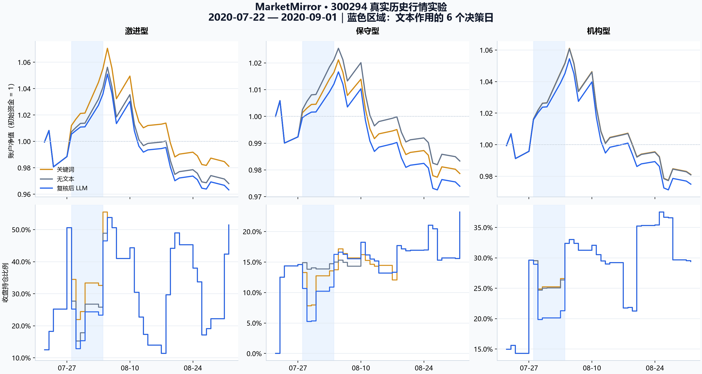

# 300294：真实公司回复、实时 DeepSeek 提取与真实历史行情实验

2026-10-06 实际执行完成。本轮重新向 `DeepSeek-V4-Flash-0731-W8A8` 发起事实提取请求，使用公司回复与已归档的真实历史收益，运行无文本、关键词、复核后 LLM 三个条件。每个条件包含三类预设 Agent、30 个交易日，共 **270 次决策**。账务复算及离线重放通过。

**此次 LLM 条件下三类策略的收益都低于无文本对照。** 这验证了来源到决策、账户和对照结果的链路，也暴露出当前“不确定性直接减仓”规则需要进一步检验。结果不能证明真实投资能力或 LLM 的普遍优劣。

## 冻结设计与实际调用

- 选样：在查看本轮策略收益前，选择既有来源登记中第一条公司回复，股票代码 `300294`；是已查看的开发案例。
- 来源：用户提供的 2020 年问答工作簿经既有导入归档，原文位于 `research_outputs/semantic_holdout_h2_2020/annotation_items.jsonl`；只采用公司回复建立确认事实。
- 回复日期：2020-07-24，仅精确到日期，保守取北京时间日结束才可见。
- 行情：2026-09-27 已归档 BaoStock 数据，股票使用供应商 `pctChg / 100`，沪深 300 使用连续收盘价比值。选中股票和基准各 145 个收益值与原始供应商记录重新核对一致。
- 决策窗口：2020-07-22 至 2020-09-01，共 30 个交易日。文本首次在 2020-07-28 决策进入，信息截点为 2020-07-24，执行参考日为 2020-07-27；作用六个决策日，至 2020-08-04。
- 输入：截至 `t−2` 的五日沪深 300 动量与二十日股票波动；三类参数沿用原登记配置，每类初资 100,000，单边费用 0.1%。
- 大模型：网关 `http://aigw.dlut.edu.cn/v1`，模型 `DeepSeek-V4-Flash-0731-W8A8`，温度 0；发送来源类型及原文段落，保存原始返回。
- 请求时间：2026-10-06 16:23:35 至 16:24:08（北京时间），输出三条事实；逐条助手复核在回放前保存，三条均接受，未修改。

冻结计划保存来源、行情、代码、参数与提示词的 SHA-256。运行阶段检查这些依赖，离线复现直接使用保存的模型返回和复核结果。

## 文本实际进入了什么

公司回复包含基金收购背景、原料血浆采购调拨的特殊审批及不确定性、一般研发表述。模型抽取为一条审批不确定事实和两条静态信息，原文引文及字符区间全部匹配。

| 条件 | 方向输入 | 不确定性输入 | 依据 |
| --- | ---: | ---: | --- |
| 无文本 | 0 | 0 | 不使用文本 |
| 关键词 | +0.25 | 0.6 | 回复中的“收购”和“不确定” |
| 复核后 LLM | 0 | 0.6 | 审批不确定；收购背景及研发表述不构成有完成时间的新事件 |

这些数值来自原有声明映射，**不是大模型估计的收益预测或由本轮结果拟合的强度**。三类 Agent 的规则使用 `市场敏感度 × 市场信号 + 文本敏感度 × 方向输入 − 不确定性厌恶 × 不确定性输入` 形成分值，再施加风险、确认、再平衡、资金及持仓约束。

## 实际结果



收益包含已记账费用；相对差以百分点计。三组条件使用相同历史价格路径。

| 条件 | 策略 | 收益 % | 相对无文本 pp | 最大回撤 % | 有成交的决策日 | 累计费用 |
| --- | --- | ---: | ---: | ---: | ---: | ---: |
| 无文本 | 激进型 | -3.1965 | 0 | 8.3485 | 30 | 276.82 |
| 无文本 | 保守型 | -1.6666 | 0 | 4.2436 | 13 | 45.07 |
| 无文本 | 机构型 | -1.9134 | 0 | 7.8864 | 10 | 74.35 |
| 关键词 | 激进型 | -1.8824 | +1.3141 | 8.3485 | 30 | 270.82 |
| 关键词 | 保守型 | -2.1347 | -0.4682 | 4.2968 | 13 | 55.96 |
| 关键词 | 机构型 | -1.8904 | +0.0230 | 7.8864 | 10 | 73.94 |
| 复核后 LLM | 激进型 | -3.6730 | -0.4764 | 8.3485 | 30 | 280.85 |
| 复核后 LLM | 保守型 | -2.6096 | -0.9430 | 4.3401 | 14 | 61.55 |
| 复核后 LLM | 机构型 | -2.5026 | -0.5892 | 7.8867 | 10 | 84.27 |

整个窗口股票收益为 -5.8748%；六个文本作用日全部上涨，累计 +22.2223%。LLM 条件只增加审批不确定性输入，当前规则使持仓降低，错过部分这段上涨；这属于既定策略在实际行情上的响应，不表示审批消息造成了后续涨跌。

用“当日成交后持仓单位差 × 当日实际价格变化 − 当日费用差”逐日分解，相对无文本的最终财富差全部与账户一致：

| LLM 策略 | 六个作用日的持仓损益差 | 其他日期的持仓损益差 | 额外费用 | 最终财富差 |
| --- | ---: | ---: | ---: | ---: |
| 激进型 | -507.57 | +35.19 | +4.03 | -476.41 |
| 保守型 | -894.79 | -31.74 | +16.48 | -943.01 |
| 机构型 | -621.30 | +41.98 | +9.92 | -589.24 |

作用期结束后输入恢复为零，账户状态仍保留此前交易的影响。保守型的确认与小额交易限制、机构型的再平衡和风险限制，也使响应幅度与激进型不同。

## 核验与本地产物

相关 28 项测试通过，覆盖信息时间、未来收益隔离、停牌禁止成交、资金及持仓、来源事实及独立核验器对缺失天数、提前文本、错误净值、延长作用期的拒绝。

三条件共 90 个路径日、270 次决策逐项核对；公开前四个决策日与无文本账户一致。费用、现金、归一化持仓单位、净值、回撤均复算。再次执行离线核验时未调用 LLM，路径与比较表精确一致。六组收益差分解也与最终账户一致。

完整本地目录：`research_outputs/real_observed_experiment_20261006_v1/`。

| 文件 | 内容 |
| --- | --- |
| `plan.json` / `plan_receipt.json` | 来源、窗口、参数、代码与数据哈希，模型调用前冻结 |
| `model.json` | 本轮真实模型原始返回、规范化事实、时间和发送内容哈希 |
| `review.json` | 回放前的逐条助手原文复核，非独立标注 |
| `result.json` / `result_manifest.json` | 完整逐日输入、决策、交易账户及产物哈希 |
| `summary.csv` / `report.md` | 九组策略结果及简明报告 |
| `attribution.json` / `analysis_manifest.json` | 相对损益逐日分解及图形哈希 |
| `comparison.png` / `comparison.svg` | 三类策略净值、仓位和文本作用期图 |

关键 SHA-256：

```text
plan.json   49fbbb9933c655b7da59e4bc9161560f0e647974f776d49ec34db336c217c503
model.json  2cce89f1cca7ee8b77abc6723d67821466a6381e416ee85bb453113395ac4eab
review.json 8b787a5c3b121e0cbe2b43187a8cc095a9729f64f25e1198b7e8f29624f83007
result.json 640b644b8e046199ef006af0ecb08d0ebb12213461eab727b8ad291749df98ab
```

## 复现命令

在项目根目录，本机具有上述冻结源档时，核验已有结果：

```powershell
python -B -X utf8 -m research.simulation.single_observed_case verify --run-dir research_outputs/real_observed_experiment_20261006_v1
```

新一轮执行必须使用新目录；先冻结设计，再调用模型，助手逐条检查来源并保存 `review.json` 后才能运行：

```powershell
python -B -X utf8 -m research.simulation.single_observed_case prepare --run-dir research_outputs/real_observed_experiment_next
python -B -X utf8 -m research.simulation.single_observed_case extract --run-dir research_outputs/real_observed_experiment_next
# 保存逐条来源复核记录后执行 run；此处没有请求用户审批的环节。
python -B -X utf8 -m research.simulation.single_observed_case run --run-dir research_outputs/real_observed_experiment_next
python -B -X utf8 -m research.simulation.single_observed_case verify --run-dir research_outputs/real_observed_experiment_next
```

图形为可选依赖，可在完成回放后生成：

```powershell
python -m pip install --target research_outputs/plot_runtime -r requirements-plots.txt
python -B -X utf8 -m research.simulation.analyze_single_observed_case --run-dir research_outputs/real_observed_experiment_next --plot --plot-packages research_outputs/plot_runtime
```

本次绘图使用 Python 3.13.9、Matplotlib 3.11.2，并已实际查看图片。脚本禁止覆盖已有正式产物。原始问答、行情和本地结果不随 Git 分发；新克隆须恢复相应研究输入后才能重放此实验。平台的新建实验仍使用合成市场，本轮结果是单独的研究运行，没有自动加入网页实验列表。

## 解释边界与下一项

这是单家公司、单条回复的已查看开发实验，使用当前回取的历史数据版本。角色、数值映射、六日作用期和初始资源均为声明假设，Agent 尚未由真实投资者数据训练。当前模型输出归类合理，不等于能预测股票涨跌。

历史价格由真实收益固定，Agent 不改变它。指数从 100 归一化，持仓为指数单位；成交按前一收盘参考指数，考虑停牌、资金和只做多限制。整手、涨跌停排队、滑点、盘口和市场冲击尚未纳入，不能视为实盘成交。

下一项应在新的预先登记多案例中分别比较“不确定性直接减仓”“降低响应确信度”“等待确认”，独立报告三类行为和风险差异。还需完善仅有不确定性时的决策证据：目前逐日 `source_link` 已保存引文，但决策自身的 `evidence` 在方向为零时只列市场依据。这次保存全部原始行为，没有据收益反向调参；原 v6 自动语义入口保持未放行。
